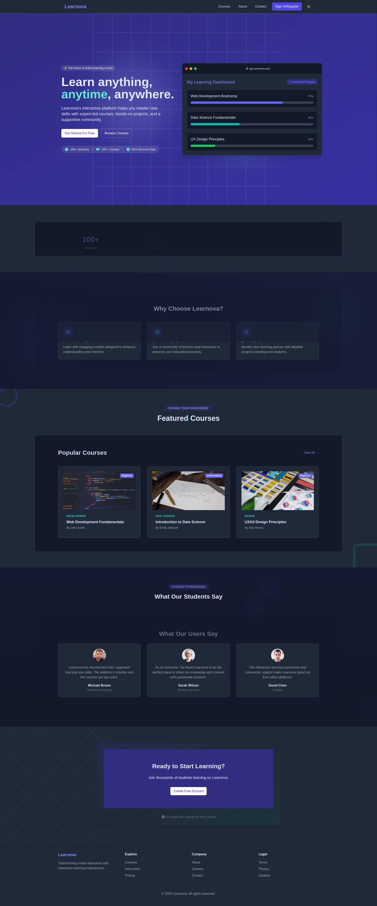

# Learnova

## Overview
Learnova is a fully functional educational platform designed to transform online learning. It provides a seamless experience for students and instructors with features like user management, course creation, lesson management, quizzes, assignments, forums, and more. The platform is built with Express.js, Prisma, and PostgreSQL for a robust backend.

## Features
- User authentication and management
- Course creation and management
- Lesson and content delivery
- Interactive quizzes and assignments
- Community forums for discussions
- Real-time progress tracking
- Responsive design for all devices

## Setup
1. Install dependencies: `npm install`
2. Set up environment variables in `.env` (see `.env.example`)
3. Run migrations: `npx prisma migrate dev`
4. Start server: `npm run dev`

## Environment Variables
- `DATABASE_URL`: PostgreSQL connection string
- `JWT_SECRET`: Secret for JWT authentication
- `PORT`: Server port (default: 5000)

## Database Diagrams
- [](https://mermaid.live/edit#pako:eNq9Vctu2zAQ_BWBZ9uwlMgP3YwWAYo0QYq0l8JAwJBrmYhEGkuqbmL737uSGMd6FAiStLpY3BmOZrm75o4JI4ElDPCz4inyfKkDen5YwGC_Hw7NLvhkCrQQJIHS1mEhnO1ybtCkCNYSyyEXDz2UhbZbWiWBLe5z1SdyWwLWKqOJJRC4gx7W9zUhkhi8cGuDfWaMdYRvUfUKXBunVkpwV38IQYD69Uz0yXrqlZFFVqYujHac8u-Q9vvgwmCRE2fNezXaRwPyTuma6OU98SuR6tQbH2uSvhXqqSqFyAoJvZQFHWGqc9Du1FS18SgC1mff_NYRaNfsKFMn2y5FU8WHm9U4KlTrJoawyRTYO2dqykkGfa3xUrGT4u7q9_JRtE_J4ObyJUSNq3QaQM5V1oluuLVbg7IDoMmgE1wptO6a510k421AUgs7lYPvZrlwPVixkafYof5ptNKrknPK9dilJhGoNmVVWyJ-mg1-kcHF5Qea9u34L0yL6jxahkuAygf4gTn4YXxHDuVMUAc3BfLqaP6D_2rc3-L-ry7fZIkNWA5IUyfpjqnsLJlbA80IS-hVcnxYsqUuefR3bm4ftWAJtSUMGJoiXbNkxTNLq1rY31HH6Ibrn8bkz1tAKmrnq_pGqy62isKSHfvNkmEURaPzSXh2Np9E83AWx_GAPZbxcDwax-E0nEzjeDY_j-PDgD1VutFoPI1ms3kUxuNxOI_DAUuxTMZ7BE1loyHVjiXhJJod_gA2mkhO)

- [](https://mermaid.live/edit#pako:eNq1V21v2jAQ_iuRP0604lV0VlUJAVWZKN0gaNOEhNzYgFViU9tZ11b8911eSkISAmvTfIl9Pp-fe-58tl-RIylDGDlronWPk6Ui7kxY8AUSa6qZsl5Dif9xYSxO4742ioulxVzC1xnpBiw8SZVVX3ClzYi4LDMCi6YGKDHMcJdZjmLQpB2TM-ZtaHJsm3ZhLNcs6cblJROeyxQxXIqrq3ig07sdjOLuYDSxx9OufTeOZRN72uuP7JyVutJTmp1Al-FmnfWdMu0ovvEhpSwI0PAcI9WAlkjMraTe-hPgOgENSai-FPKAqRLRD5nWUrwbvSOFYcLsz3YDRj4b-Q-Pv_w_7nx8JYBh2g9hESC__wigB1mQj9H0LPrnTZZ0GWSLzgmGUswxHaGfSmY6RGcDmJO2_-10aA--D_vz7s3doNuPB6AK9OfXneEkIZvc3I3teWc0-dkf5yweenOc1xBiOuk8qFo5fJMURfcSKhsRFtfdkMMS2buWynOP4c9u9g-va69gIj228MJHdyJrqa30YYTfpTbH8JnAixMB5lajDVEgK5XajtZ8KVwwW37ZLyhO1GM9aJfoSDck7OSNbfd_2XFvOh7GnW-Tu1HOChPv3uVA1_HSSHakvjfa-3I7r3QuGKP3xHnYXwCua7TUxFZyqeBgPeZy2rHDx_4mslgiyJE0fMEdcsqxdSACLiAiS5ZXR8ewaz8MNmwEl-cZqs2QdXZ2Ba0v0IouiXh3q9MFyrt4YMsoiH6RbnTeYEv7mVtoNpHbOPKsSD0qyNginllJVQjYr4zYelK82OReDLEFJxfjf95mRBSl50T3VRzsE8LFYW2_FZ5e2FqRYqtpihmd8yh-0YLpGdHNM43jgHZw2_Oj7aw9yop1E-U5ATywkDUb3dvSMHYDB_NjZzik6GC09-1G4gMB39kM-geUFNusOdNzI0PdhLuFGbqfHbv3nK8dJNceV4kbn6-Q4ImyBRdxjsUHiK-3tyDcLVxiNKogOEvgaUvhhRwUmhkyKwavU4ShSYl6mKGZ2IIe7Aw5eRYOwrCnWQUp6S1XCC_IWkMvLBDR83on3RDxW0r3bQqjHF54t9F73P8FKgi_or8I16vN81q7Vm20qtV2s9H4WkHPCDcvzhu1erN90WrXWxftVn1bQS-Bzeo5dKuJr1ZBS-V7EgFkAl41sCeEQbjWrl5s_wFQ6Mrx)